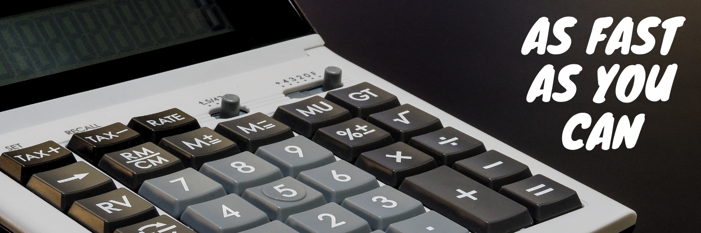

## About :

Calc - A simple interesting Javascript calculating game. Try how hard you can hit it in 30 seconds. Always re-hit to beat your highest hit. !!

## Rules :

1. Click on Let's Play.
2. Use your numpad on the keyboard or the given virtual keyboard to enter your result for the calculation posed.
3. When you hit it right, screen turns green and red when it's a wrong.
4. Give it a try, how strong you can hit maximum in 30 seconds.

> My best is 15 hits.
> Computer's best is 29 hits.
> Whats's yours ?

> Hit it here :
> [Play it here](http://birthday-reminder.infinityfreeapp.com/)

> Project Demo :
> [Click Here for demo](https://www.youtube.com/channel/UCR2gr-sBjqnH0gW-Ca6i7Hw?sub_confirmation=1)
